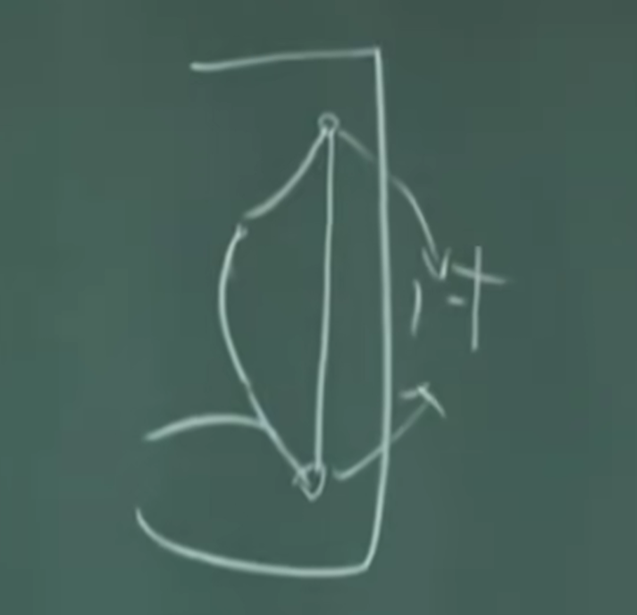

## 一、穴道丈量的方法

### 1. 同身寸

每個人高矮不同，故每個人的寸也不一樣 
同身寸應用在四肢與筋絡之間

  1. 中指彎誠如圖為一吋
  
  2. 三支手指頭張開為兩寸
  3. 四支手指頭張開為三寸

## 二、下針深淺
背薄似餅 > 在背上下針要下淺 
腹深似井 > 在背上下針要下深

### 1. 在過去針灸非常著重節氣
  
  1. 春夏下針比較淺
  2. 秋冬下針比較淺

### 2. 觀念:傷哪就下到哪
  1. 皮毛 肺 在管
  2. 肌肉 脾 在管
  3. 血脈 心 在管
  4. 骨頭 腎 在管

## 三、一般入穴針刺的方法
  1. 用西醫的針，扎一次就丟掉
  2. 穴位只會在肌肉跟肌肉的縫隙之間  
  3. 穴位或是在肌肉與骨頭之間
  4. 穴位或是在肌肉與筋之間
  5. 沒有任何穴位在血管上面